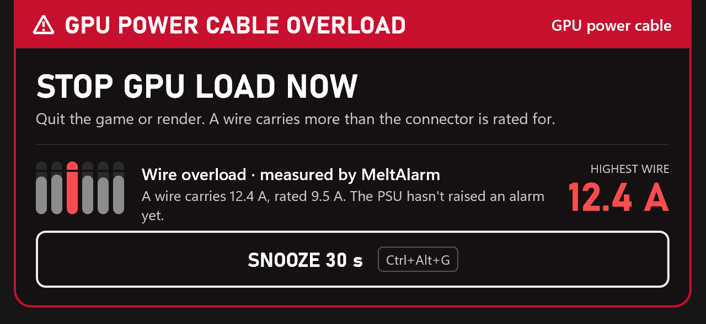
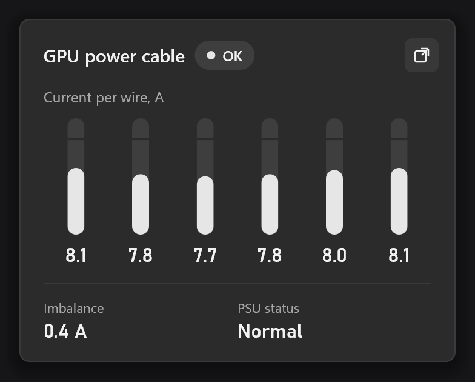
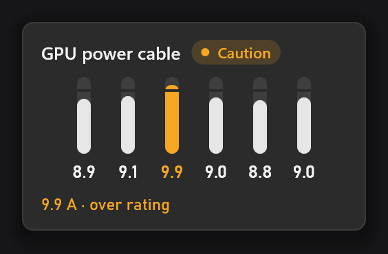

# MeltAlarm



**MeltAlarm tells you within seconds when a wire in your GPU power cable carries more current than the connector is built for.** It reads the per-wire currents your power supply already measures and puts an alarm on top of your game, before the cable gets hot.

It works only with **MSI MPG Ai1300TS and Ai1600TS** power supplies connected by USB, on Windows, with any graphics card. Other power supplies don't report their wire currents, so MeltAlarm can't watch them.

**Install**
1. Download `meltalarm.exe` from [Releases](../../releases/latest) and run it.
2. Windows warns that it doesn't recognize the app, because it isn't code-signed. Click **More info → Run anyway**. ([Is that safe?](#is-it-safe-to-run))
3. Click **Install**. MeltAlarm now starts with Windows and lives in the tray as six small squares. Windows may hide new icons under the **^** arrow; click the notification that appears to keep it visible.
4. Right-click it and choose **Test alarm** once, so you know what it sounds like.

**If it goes off**
1. Quit the game or stop the job. Now, not after the match.
2. When it's quiet, shut down the PC and switch off the power supply.
3. Check the 16-pin plug at both ends, on the card and on the PSU. It must be pushed all the way in, with no gap. Look for brown, shiny or melted plastic. If a cable ever got hot, replace it; don't reuse it.

That's all you need. The rest is for when you want to know more.

---

## Why I built it

MeltAlarm is my personal project. I built it as an alternative to keeping MSI Center open just to watch the cable. I wanted something fast and lightweight, with nice visuals, so I vibe-coded it.

The idea is simple. Your power supply already measures every wire of the GPU cable. MeltAlarm reads those numbers once a second and checks them against what the connector is rated for. If a wire is overloaded, you see it and hear it within seconds, not minutes.

It doesn't replace MSI Center for changing your PSU's settings. MeltAlarm only reads; it never changes anything.

## What you'll see

Most of the time, nothing. The tray icon is six neutral squares, one per wire. Color appears only when something needs you.



**Click the tray icon** to see each wire. A full bar means the alarm limit. The cut near the top of each bar is the connector's rating, 9.5 A. A healthy RTX 5090 at full load sits around 8 A per wire.


**A wire above its rating for 10 seconds** gets a small amber strip at the top of the screen, for 10 seconds, with one soft chime. Clicks go through it to your game.

**A wire overloaded** gets the big red alarm at the top of every monitor (the picture at the top). It plays the Windows alarm sound and says *"Warning. GPU power cable overload. Stop the game now."* until the load drops or you snooze it for 30 seconds (the button, or **Ctrl+Alt+G**). When it clears, it turns green for 5 seconds.

**Uneven load** (one wire carrying much less than the others, usually a plug that isn't fully seated) gets a quiet Windows notification. Windows holds it back during games and shows it afterwards, which is when you can do something about it.

Anything that reached you leaves a note in the tray window until you dismiss it, even after a restart. If the PSU cut the power during an alarm, MeltAlarm reminds you at the next start.

## Using it

**Tray menu** (right-click the icon):
- **Track GPU power cable 1 / 2**: which of the PSU's two 12V-2x6 sockets get a tray icon. With two graphics cards, track both.
- **Alerts (on screen, sound, voice)**: turns every interruption off. Colors, notes and the log stay.
- **Run at Windows startup**
- **Test alarm**: the caution strip, then the full alarm, marked TEST.
- **Open alarm log**
- **Exit**



**The floating view.** To keep an eye on the cable during a stress test or on a second screen, click the pop-out button in the tray window or drag its header. The floating view stays on top and never takes focus from your game.
- Drag it anywhere.
- Drag an edge or a corner to scale it.
- The tab on its bottom edge switches between Compact (above) and Full.
- Clicking the tray icon brings it back into view.

It remembers its screen, position, size and layout.

## When exactly it warns you

Two judges watch the same cable. Either one can raise the alarm.

| | MeltAlarm | The PSU (MSI Safeguard+, default settings) |
|---|---|---|
| Caution | a wire above **9.5 A** for 10 s | — |
| Advice (after the game) | **3 A** between the most and the least loaded wire for 10 s, under load | — |
| Alarm | a wire above **10.5 A** for 4 s, or **12 A** twice, or **15 A** once | a wire above 12 A, or 5.5 A between wires, for 20 s |
| Power cut | never; it can't | 180 s after its alarm |

**Why both?** 9.5 A is the rated current of one contact in the 16-pin connector (12V-2x6, the successor of 12VHPWR). A bad contact heats up in seconds. The PSU's own protection waits 20 seconds before it says anything and up to 3 more minutes before it cuts power. A cable overloaded evenly, just below the PSU's limit, never trips it at all. MeltAlarm's limits come from the connector, not from MSI, and the PSU's alarm is passed on with its power-cut countdown.

These limits are engineering defaults, not certified safe limits. Advanced users can change them (see [Files and settings](#files-and-settings)).

## Games and performance

- **Borderless and windowed games:** everything shows on top and the game keeps focus. **Exclusive fullscreen** (rare today) can't be drawn over; you still get the sound and the voice.
- **VR:** no picture in the headset yet; the sound and the voice come through it.
- **Cost:** about 2 MB of private memory and no measurable CPU when idle. It doesn't use your GPU at all (everything is drawn on the CPU), so it can't cost you frames. It reads the PSU once a second, about 3 ms of USB time.
- **No internet.** MeltAlarm never connects to anything.

## MSI Center, Afterburner, HWiNFO

MeltAlarm runs fine next to MSI Center, the Afterburner PSU plugin and HWiNFO64, in any combination. It shares the PSU with them through MSI's own lock, the same way they share it with each other.

## What it can't do

- **It can't protect your GPU.** It can't lower the load or cut the power. It makes sure you know, in time. Only the PSU can cut power.
- **It sees only the six 12 V wires.** The six ground wires aren't measured by the PSU, and a cable that degrades evenly on every wire shows no imbalance.
- **It needs you.** An alarm nobody hears protects nothing. Keep the sound on.
- **Locked PC or remote desktop:** the alarm isn't visible; the sound depends on the session.
- **Ai1600TS:** it uses the same protocol as the Ai1300TS, but nobody has tested MeltAlarm on one yet. If you have one, please [tell us](../../issues) how it went.
- **Windows 10:** it should work, but so far it has only been tested on Windows 11.

## Is it safe to run?

Fair question: it's an unsigned program from GitHub that asks for administrator rights.

- **Why administrator:** MSI's software protects the PSU with a lock that only administrators can use. Without it, MeltAlarm would collide with MSI Center or HWiNFO. That is the only reason.
- **What it sends to your PSU:** exactly eight kinds of read request and MSI's own "hello" message, the same ones MSI Center sends. Nothing that writes, configures or saves. This isn't a promise in a README: the code can't build any other message, and an automated check rejects every other way of talking to the device.
- **Why Windows warns you:** a code-signing certificate costs money every year, and this is a free personal project. To check the file, compare its checksum with `SHA256SUMS` on the release page:
  ```powershell
  Get-FileHash .\meltalarm.exe
  ```
- **Or build it yourself** (below).

## Files and settings

| What | Where |
|---|---|
| The program | `C:\Program Files\MeltAlarm\meltalarm.exe` |
| Settings | `%APPDATA%\MeltAlarm\settings.toml` |
| Cable notes | `%APPDATA%\MeltAlarm\state.toml` |
| Floating view positions | `%APPDATA%\MeltAlarm\window.toml` (delete it to reset) |
| Alarm log | `%LOCALAPPDATA%\MeltAlarm\alarms.log`: one line per event, never per second |

**Changing the limits** (only if you know why): add any of these to `settings.toml` and restart MeltAlarm.

| Key | Default |
|---|---|
| `limit_rating` | 9.5 (A, caution) |
| `limit_alarm` | 10.5 (A) |
| `limit_alarm_seconds` | 4 |
| `limit_fast` | 12.0 (A, alarm on the second reading) |
| `limit_instant` | 15.0 (A, alarm on one reading) |
| `limit_uneven` | 3.0 (A between the most and least loaded wire) |

They must stay in order (rating < alarm < fast < instant, all between 5 and 30 A), or MeltAlarm ignores them all, uses the defaults and says so in the log.

**Update:** download the new version and run it; it offers **Update**. **Uninstall:** Windows Settings → Apps → Installed apps → MeltAlarm. Your settings and log stay unless you tick the box to delete them. **Don't want to install?** Choose **Run without installing** on the first screen.

## For developers

Rust (1.88+, MSVC toolchain), Win32 and Direct2D in software mode. One exe, no installer, no runtime.

```sh
cargo test --workspace --exclude meltalarm-win
cargo test -p meltalarm-win --features simulate
cargo build --release -p meltalarm-win
```

**Without the hardware:** build with `--features simulate` and run `meltalarm.exe --portable`. It plays scripted scenarios (`MELTALARM_SIM=cycle` walks through every alert) and never touches USB.

The logic is portable and vendor-neutral: a new power supply, or another device that measures per-wire current, is one new source crate, and Linux is a new frontend. Neither exists yet. If you own hardware that reports per-wire currents, open an issue.

- [`docs/FUNCTIONAL_SPEC.md`](docs/FUNCTIONAL_SPEC.md): what it does and why, including the measurements behind the limits
- [`docs/DESIGN.md`](docs/DESIGN.md): how it looks, and why
- [`docs/ARCHITECTURE.md`](docs/ARCHITECTURE.md): how it's built
- [`AGENTS.md`](AGENTS.md): the principles, for people and AI agents working on it

## How it was made

The idea, the testing on real hardware and the decisions are mine. The analysis, the design and the code were written with Claude Opus 5.5, in a fixed order:
- a functional spec, then the design, then the architecture, then the code
- 85 automated tests
- the screens checked in a simulator before they shipped

All of it is in `docs/`, and `AGENTS.md` describes how the work is done.

## Disclaimer

MeltAlarm is provided as is, without warranty of any kind (see the license), and you use it at your own risk. It reads your power supply and never changes it, but it is no substitute for a correctly seated cable, a sensible power limit and the PSU's own protection.

MeltAlarm is not affiliated with, endorsed by or supported by MSI. MSI and MPG are trademarks of Micro-Star International Co., Ltd.

## License

[MIT](LICENSE)
