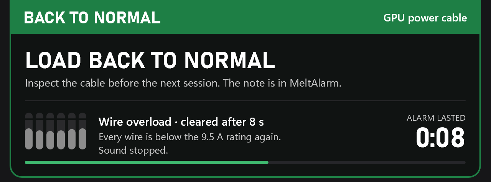

# MeltAlarm

MeltAlarm is a small Windows tray app that warns you when a wire in your graphics card's power cable is overloaded, before the connector has time to overheat. 

> [!WARNING]
> **MeltAlarm works only with the MSI MPG Ai1300TS and Ai1600TS power supplies.**
>
> These two measure the current in each wire of the cable, and MeltAlarm reads those measurements over USB. Other power supplies don't expose this data. With any other PSU, MeltAlarm shows a message after two minutes and exits. It can't watch your cable.

<p>

&nbsp;&nbsp;

</p>

## Quick start

1. Download `meltalarm.exe` from [Releases](../../releases/latest) and run it.
2. Windows SmartScreen will say it doesn't recognize the app. That's because the exe isn't code-signed: a certificate costs money every year, and this is a personal project. Click *More info*, then *Run anyway*. If you'd rather check the file first, compare the output of `Get-FileHash .\meltalarm.exe` with `SHA256SUMS` on the release page. Releases are built by GitHub from the tagged source, which you can verify with `gh attestation verify meltalarm.exe --repo DeniDoman/meltalarm`.
3. Choose *Install*. MeltAlarm copies itself to Program Files and from then on starts with Windows. It asks for administrator rights; [How it works](#how-it-works) explains why.
4. Windows 11 hides new tray icons under the **^** arrow. Click the notification MeltAlarm shows after installing to keep the icon visible.
5. Right-click the icon and choose *Test alarm* once, so you know what it looks and sounds like.

To update, download the new version and run it. To uninstall, go to Settings → Apps → Installed apps; your settings and alarm log are kept unless you choose to delete them.

## Using it

Click the tray icon to see the current in each wire. The top of each bar is the alarm limit, and the gap just below it marks the 9.5 A rating. To keep an eye on the cable during a stress test or on a second screen, drag the window by its header or click its pop-out button. It becomes a floating view that stays on top without ever taking focus from your game. You can scale it, and switch it to a compact layout with the tab on its bottom edge.


The right-click menu has the rest:
- which of the PSU's two 16-pin connectors to watch (numbered as on the PSU; with two graphics cards, both)
- a switch that turns all alerts off
- start with Windows
- the test alarm
- the alarm log

## Why

A modern graphics card draws its power through a single 16-pin cable: the 12V-2x6 connector, the revised version of 12VHPWR. At 600 W it carries 50 A over six thin wires, and each contact is rated for about 9.5 A, so there is little headroom. When one contact is worn or not fully seated, the other wires take over its share. A contact heats up within seconds, and that is how connectors melt.

The Ai1300TS and Ai1600TS can see this happening, and MSI's protection (Safeguard+) does react, but it is tuned to avoid false alarms. With the default settings, a wire has to stay above 12 A for 20 seconds before the PSU raises an alarm, and it cuts the power up to 3 minutes after that. A cable that is overloaded evenly, just below 12 A on every wire, never trips it at all.

I wanted to know about it in seconds, not minutes, and without keeping MSI Center open all the time. MeltAlarm is my personal project for exactly that: small, fast, and quiet until something is actually wrong.

## What it does

Once a second, MeltAlarm reads the six currents and checks them against the connector's own rating rather than against MSI's settings. It also passes on the PSU's alarm the moment the PSU raises it, together with its power-cut countdown. Whichever of the two notices a problem first raises the alarm, and how loud MeltAlarm gets depends on how serious the problem is:

| What happens | What you get |
|---|---|
| A wire stays above its 9.5 A rating for 10 s | A small amber strip at the top of the screen for 10 s, with one soft chime |
| A wire stays above 10.5 A for 4 s, reaches 12 A twice or 15 A once, or the PSU raises its own alarm | The red alarm on every monitor, the Windows alarm sound and a spoken warning, until the load drops |
| One wire carries much less than the others (3 A apart, under load) | A silent Windows notification, which Windows holds back until your game is over |


Anything that reached you leaves a note in MeltAlarm until you dismiss it, so you still see it after the game or after a restart. If the PSU cut the power during an alarm, MeltAlarm reminds you the next time it starts.

These limits are engineering defaults based on the connector's rating, not certified safe values. For scale: on an RTX 5090, the hottest wire at full load (about 575 W) on a healthy cable sits at 8.6 A. When nothing is wrong, MeltAlarm stays out of the way, as six small grey squares in the tray.

## If the alarm goes off

When a wire is overloaded, or the PSU raises its own alarm, the red alarm shown at the top of this page appears on every monitor, with the Windows alarm sound and a spoken warning. It stays until the load drops. Then:

1. Stop the load first: quit the game, or stop the render or the training run. Don't wait for the end of the round. If you need a moment to save, *Snooze* (or Ctrl+Alt+G) silences it for 30 seconds.

   Once the load is back to normal, the alarm turns green for a few seconds and the sound stops. It still asks you to inspect the cable, because a wire that has cooled down doesn't prove the contact is undamaged.

   

2. Shut down the PC and switch off the power supply.
3. Look at the 16-pin plug at both ends, on the graphics card and on the PSU. It should be pushed in all the way, with no gap, and the plastic should show no brown, shiny or melted spots. A cable that ever got hot should be replaced, not reused.

## Games and overhead

The alert windows never take focus, so a borderless or windowed game keeps running underneath them. Exclusive fullscreen, which few games use today, can't be drawn over, but you still get the sound and the spoken warning. In VR it's the sound only, for now.

When idle, MeltAlarm uses about 2 MB of memory and no measurable CPU time. It never touches the GPU (everything is drawn in software), so it can't cost you frames. It never connects to the internet.

## What it can't do

MeltAlarm can't protect your hardware by itself. It can't reduce the load or cut the power; only the PSU can do that. What it does is make sure you know in time to act.

It also sees only what the PSU measures: the six 12 V wires. The ground side of the cable isn't measured, and a cable that wears out evenly on every wire won't show up as uneven.

So far it has been tested on an Ai1300TS under Windows 11. The Ai1600TS uses the same protocol and Windows 10 should work. If you run either, please [open an issue](../../issues) and tell me how it went.

## How it works

MeltAlarm talks to the PSU over USB HID, with the same requests MSI Center uses. It needs administrator rights for one reason: MSI's software coordinates access to the PSU through a system-wide lock that only administrators can open. MeltAlarm takes the same lock, which is also why it can run side by side with MSI Center, the Afterburner PSU plugin and HWiNFO64.

It is read-only by construction. The only messages it can build are eight register reads and MSI's connect handshake. They come from a closed set of requests and one function that turns them into bytes, and they leave through a single write call. A clippy lint rejects every other hidapi call that could send data to the device. MeltAlarm never changes a PSU setting.

The app is written in Rust: Win32, and Direct2D in software mode. It ships as one executable of about 1 MB, with no installer and no runtime. The decision logic lives in a pure core that knows nothing about MSI. The PSU sits behind a small source interface, so another device that measures per-wire current, or a Linux frontend, can be added without touching the core. Neither exists yet.

```sh
cargo build --release -p meltalarm-win
cargo test --workspace --exclude meltalarm-win
```

You don't need the hardware to work on it. Build with `--features simulate` and run `meltalarm.exe --portable`: a simulated PSU plays scripted scenarios, and `MELTALARM_SIM=cycle` walks through every alert.

The reasoning behind all of it is written down:
- [`docs/FUNCTIONAL_SPEC.md`](docs/FUNCTIONAL_SPEC.md): what it does and why, with the measurements behind the limits and how to override them
- [`docs/DESIGN.md`](docs/DESIGN.md): how it looks
- [`docs/ARCHITECTURE.md`](docs/ARCHITECTURE.md): how it's built
- [`AGENTS.md`](AGENTS.md): the principles the project is developed by

## How it was made

I vibe-coded MeltAlarm with Claude Opus 5.5. The idea, the testing on real hardware and the decisions are mine. The analysis, the design and the code were written with Claude Code, in a fixed order: functional spec, design, architecture, then code. It has 85 automated tests, and its screens were checked in the simulator before they shipped.

## License and disclaimer

MeltAlarm is provided as is, without warranty, under the [MIT license](LICENSE), and you use it at your own risk. It only reads your PSU, but it doesn't replace a properly seated cable, a sensible power limit or the PSU's own protection.

MeltAlarm isn't affiliated with or endorsed by MSI. MSI and MPG are trademarks of Micro-Star International Co., Ltd.
